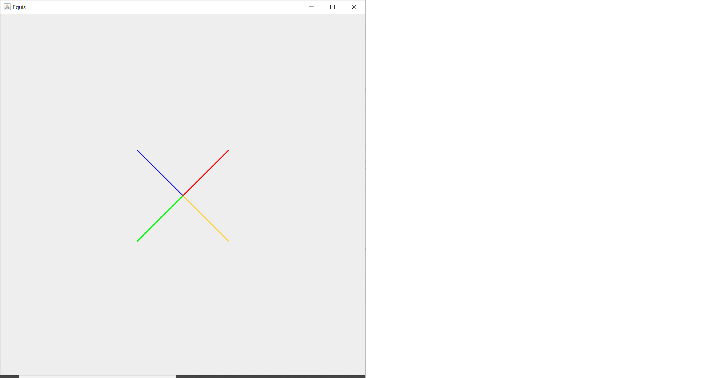

# Entrega 1

Una vez clonado el repo desde Eclipse, cree un **record** de nombre `Vector2D` dentro del paquete `geometria`. Si activa la casilla para la generación del método `public static void main(String[] args)`, podrá hacer las pruebas en el mismo record.

Hecho lo anterior, realice los siguientes ejercicios:

## Ejercicio 1

Complete el tipo `Vector2D` con la siguiente descripción:

**Propiedades:**

- `x`, de tipo `Double`.
- `y`, de tipo `Double`.
- `modulo`, de tipo `Double`, derivada. La fórmula para calcular el módulo es la siguiente: `Math.sqrt(x * x + y * y)`.
- `angulo`, de tipo `Double`, derivada. Utilice la función `Math.atan2(y, x)` para calcular el ángulo del vector.
- `copy`, de tipo `Vector2D`, derivada (copia del vector).
- `ortogonal`, de tipo `Vector2D`, derivada. Vector perpendicular. Para ello cree un objeto de coordenadas `-y, x`.
- `unitario`, de tipo `Vector2D`, derivada. Vector de módulo 1 y mismo ángulo. 

**Operaciones:**

- `neg()`, unario: Negación. Basta con crear otro vector de coordenadas `-x,  -y`
- `add(Vector2D v)`, binario: Suma con otro vector. Basta con crear otro vector de coordenadas `x + v.x, y + v.y`
- `sub(Vector2D v)`, binario: Resta con otro vector. Basta con crear otro vector de coordenadas `x - v.x, y - v.y`
- `mul(Double factor)`, binario: Producto con un valor escalar. Basta con crear otro vector de coordenadas `x * factor, y * factor`

**Métodos de factoría:**

- `parse(String text)`: Construye un objeto a partir de una cadena de caracteres con la información de las propiedades básicas separadas por comas. Tome el mismo orden en el que aparecen las propiedades en la descripción.
- `ofRadianes(Double modulo, Double angulo)`: Construye un objeto a partir del módulo y el ángulo en radianes. El módulo debe ser mayor o igual que cero. Las coordenadas cartesianas son: `y = modulo * sin(angulo)` y `x = modulo * cos(angulo)`.
- `ofGrados(Double modulo, Double angulo)`: Construye un objeto a partir del módulo y el ángulo en grados. El módulo debe ser mayor o igual que cero. Puede usar el método anterior, convirtiendo previamente los ángulos a radianes con la función `Math.toRadians(angulo)`.

**Otros métodos:**

- `multiplyEscalar(Vector2D v)`: Devuelve el producto escalar con el vector que se pasa como parámetro. Para ello, puede realizar el siguiente cálculo: `x*v.x + y*v.y`
- `proyectaSobre(Vector2D v)`: Devuelve un vector que es la proyección sobre el que se pasa como parámetro. Para ello, puede realizar el siguiente cálculo: `v.unitario().mul(multiplyEscalar(v.unitario()))`
## Ejercicio 2
- Pruebe algunos de las propiedades y métodos anteriores (como mínimo tres pruebas, entre ellas debe estar obligatoriamente *proyectaSobre*). Puede usar el método *dibuja* de la clase *VectorDisplay* para ver el resultado en pantalla.
- Use el método *dibuja* de la clase *VectorDisplay* para hacer el dibujo que se muestra a continuación. Puede tomar como referencia, un primer vector de coordenadas `1.0,1.0`

Recuerde que todos los proyectos pasaran una prueba anti-plagio.
